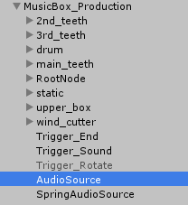

# ジュエリーボックス付きオルゴール取扱説明書

## 自分の好きな曲を設定する方法

このオルゴールにはプリセットのサンプル曲が入っていますが、
やはり自身の好きな楽曲を設定したいかと思われます。
この頁ではオーディオクリップとして取り込み、オルゴールに設定する方法を解説していきます。
なお、取り込んだオーディオの最適化については [オーディオを最適化して容量を減らす方法](optimize.md) を参照してください。

### オーディオファイルをオーディオクリップとして取り込む

まず、オーディオファイル（wavやmp3）をProjectにドラッグ＆ドロップします。
すると、下の画像のようなオーディオクリップが生成されます。

この段階で取り込んだオーディオは最適化されていなく重いので、上にも記載しましたが、
[オーディオを最適化して容量を減らす方法](optimize.md) に基づいて容量を削減することをお勧めします。

### オーディオクリップをオーディオソースに登録する

`Hierarchy` の中に取り込んだ `MusicBox_Production` の中に `AudioSource` というオーディオソースがあります。
これが、実際の楽曲を扱うためのオーディオソースになります。

こちらを選択すると `Inspector` にオーディオソースの設定が表示されますので、下記の赤い枠線で示されるプロパティに、
先ほど取り込んだオーディオクリップを設定してください。

設定することにより、オルゴールが奏でる曲の対象が変わります。

### オーディオトリガーでオーディオクリップを変更する

先ほどの設定だけでは曲を鳴らすことが出来ません。そこで、`VRC_Trigger` 側の `AudioTrigger` の設定も変更します。
まず、`Hierarchy` より、`Trigger_Sound` を選択します。

すると、`Inspector` に `VRC_Trigger` のコンポーネントが表示されますので、その中から `AudioTrigger` を選択し、
以下の赤い枠線のリストより先ほど指定したオーディオクリップを指定してください。

### 曲の長さを変更する

曲の長さを変更しなければ前に選択されていた楽曲の長さを引き継いでしまい、
途中で終わってしまったり、長い空白期間ができたりします。
そのため、設定したオーディオクリップの長さと同等、もしくはそれにプラス1秒程度の長さを指定してあげましょう。

まず、`Hierarchy` より `Trigger_End` を選択します。

すると、`Inspector` に `VRC_Trigger` のコンポーネントが表示されますので、今度は赤い枠の部分、
`Delay in Seconds` に 楽曲の長さを指定してください。例では1分21秒の曲ですので82秒を指定しています。

`Trigger_End` という名前の通り、この秒数が経った時に楽曲は停止され、再度再生するか、蓋を閉じるかの状態選択に戻ります。

これで、曲の変更は完了です。

---

Copylight(c) 2019 Azurite
