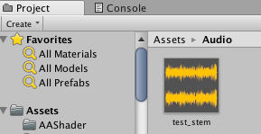
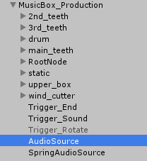
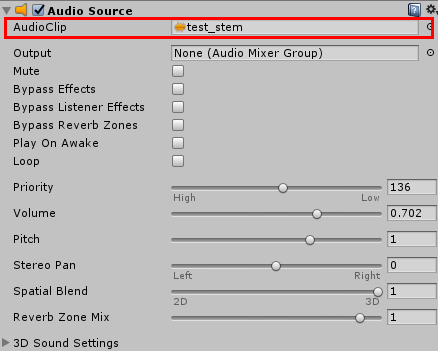

# VRChat向けジュエリーボックス付きオルゴール取扱説明書

[TOP](index.md)

## 自分の好きな曲を設定する方法

このオルゴールにはプリセットのサンプル曲が入っていますが、
やはり自身の好きな楽曲を設定したいかと思われます。
この頁ではオーディオクリップとして取り込み、オルゴールに設定する方法を解説していきます。
なお、取り込んだオーディオの最適化については [オーディオを最適化して容量を減らす方法](optimize.md) を参照してください。

### オーディオファイルをオーディオクリップとして取り込む

まず、オーディオファイル（wavやmp3）をProjectにドラッグ＆ドロップします。
すると、下の画像のようなオーディオクリップが生成されます。

この段階で取り込んだオーディオは最適化されていなく重いので、上にも記載しましたが、
[オーディオを最適化して容量を減らす方法](optimize.md) に基づいて容量を削減することをお勧めします。

### オーディオクリップをオーディオソースに登録する

`Hierarchy` の中に取り込んだ `MusicBox` ※の中の `MusicBoxDrivingMechanism` 直下に `AudioSource` というオーディオソースがあります。
これが、実際の楽曲を扱うためのオーディオソースになります。

こちらを選択すると `Inspector` にオーディオソースの設定が表示されますので、下記の赤い枠線で示されるプロパティに、
先ほど取り込んだオーディオクリップを設定してください。

設定することにより、オルゴールが奏でる曲の対象が変わります。
これで、曲の変更は完了です。

以前のバージョンで必要だったTriggerでのClipの指定や、曲長の変更は必要なくなり楽になりました！

> ※ModernMusicBox.prefab, ModernMusicBox_Original.prefab, MusicBoxDrivingMechansm.prefab, MusicBoxDrivingMechanism_Original.prefab
> を追加した場合はそれぞれ ModernMusicBoxゲームオブジェクト、MusciBoxDriingMechanismオブジェクト本体となります

---

Copylight(c) 2019 Azurite
