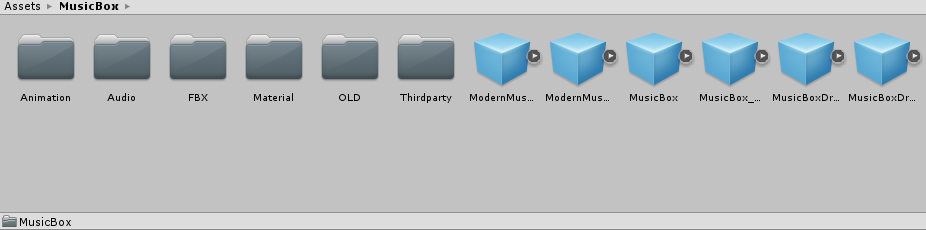
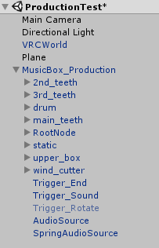
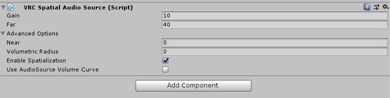
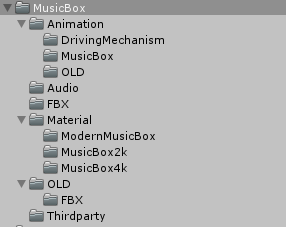

# VRChat向けジュエリーボックス付きオルゴール取扱説明書

[TOP](index.md)

## 使い方 (VRCSDK3)

SDK2版とは異なり、SDK3ではUdonSharpが必要なため最新版のUdonSharpをダウンロードし、インポートします。
https://github.com/MerlinVR/UdonSharp/releases/latest

`MusicBox_ForSDK3.unitypackage` をUnityのProjectへImportします。
Import前にVRC SDKを取り込んでいないと組み込んである `VRC_Trigger` 類のコンポーネントがロードされませんので、ご注意ください。

以降の工程は下記VRCSDK2のunitypackageインポート後の手順と同じです。（UdonSharpの有無とSDK3用のunitypackageを読み込むか否かの違いです）

## 使い方 (VRCSDK2)

`MusicBox_ForSDK2.unitypackage`(ver2020.04.02.0以前では`MusicBox_ForSDK2.unitypackage`)をUnityのProjectへImportします。
Import前にVRC SDKを取り込んでいないと組み込んである `VRC_Trigger` 類のコンポーネントがロードされませんので、ご注意ください。



その中の `MusicBox.prefab` を `Hierarchy` にドロップすると、`MusicBox`というゲームオブジェクトが生成されます。
（`MusicBox_Original.prefab`, `ModernMusicBox.prefab`, `ModernMusicBox_Original.prefab` のいずれかでも大丈夫です）



これを好きなように配置するだけで使えるようになります。
曲を変更する場合は、[自分の好きな曲を設定する方法](customize_music.md) を参照してください。

また、`MusicBoxDrivingMechanism.prefab` という改変用に機構を分離したprefabも用意しました。
こちらの改変方法については新設の [オルゴールそのものの改変方法](customize_mbox.md) を参照してください。

## 音量・音の範囲を調整する方法

VRChatのアップデートにより `ONSPAudioSource` は使えなくなり、代わりに `VRC_SpatialAudioSource` が登場しました。<br>
オルゴールの機構でも遅くなりましたが `v2020.1.1` へのアップデートへ伴い `VRC_SpatialAudioSource` をサポートしました。



|プロパティ名|説明|
|:-|:-|
|`Gain`|音量です。デフォルトは10dB（デシベル）で、アバターに組み込む場合はこれが最大となります（オルゴールはアバターではありませんが）|
|`Far`|音がどこまで届くかです。デフォルトで40mです。アバターではこれが最大値となります。|
|`Near`|音が減衰し始める距離です。公式では0mを指定することを推奨されているようです。|
|`Volumetric Radius`|オーディオソースは通常、点として扱われますが、これを設定すると"領域"として扱われるようになります。特殊な用途以外はこの値を用いることは推奨されていません。この値は常に`Far`より小さい必要があります。|
|`Use AudioSource Valume Curve`|このプロパティを有効にすることで`AudioSource`の`3D Sound Settings`が有効になります。|
|`Enable Spatialization`|このプロパティを無効にすると標準の `inverse-square falloff curve` に基づく音の減衰処理が無効になり、`AudioSource` の空間設定が有効になります。|

詳しくは [ここ](https://docs.vrchat.com/docs/vrc_spatialaudiosource) にて仕様の詳細を確認することが出来ます。

## ジュエリーボックスの扱いについて

赤い部分はジュエリーボックスになっていますので、Unity上でアクセサリのオブジェクトをいい感じに配置してそれっぽく見えるようにするといいかんじです。

## ディレクトリ構成

```
.-- Audio
 |  |- G_AIR.wav : サンプル曲 G線上のアリア
 |  `- JewelryBox.wav : サンプル曲 JewelryBox
 |- Texture
 |  |- MusicBox2k : 2Kテクスチャ類（非推奨）
 |  `- MusicBox4k : 4Kテクスチャ類（推奨）
 |- MusicBox_ForSDK3.unitypackage : SDK3向けUnityパッケージ
 |- MusicBox_ForSDK2.unitypackage : SDK2向けUnityパッケージ（ver2020.04.02.0以前では MusicBox_ForSDK2.unitypackage）
 |- MusicBox_OLD.fbx : 旧番FBXファイル
 |- MusicBox.fbx : 宝石箱単体のFBXファイル
 |- MusicBoxDrivingMechanism.fbx : 駆動部分のFBXファイル
 |- ModernMusicBox.fbx : モダンデザインの外箱FBXファイル
 |- README.txt : このファイル 
 `- LICENSE.txt : ライセンスファイル
```

モダンデザインのfbxファイルはメッシュ単体となっており、このディレクトリ構成中にはテクスチャが含まれません（そもそも無いので）
Unityパッケージの中にあるFBXに対してマテリアルを設定しているため、そちらを使う前提となっています。

## Unityパッケージ構成（SDK3）

```
MusicBox_UDON
 |- Animation
 |  |- MusicBox : 宝石箱の蓋の開閉のアニメーション設定
 |  `- DrivingMechanism : 機構部分のアニメーション設定
 |- Audio : オーディオクリップ類
 |- Material
 |  |- ModernMusicBox : モダンデザイン版のマテリアル設定
 |  |- MusicBox2k : 2Kマテリアル設定（非推奨）
 |  `- MusicBox4k : 4Kマテリアル設定（推奨） 
 |- FBX : FBXファイル類
 |- Thirdparty : モダンデザイン版に適用しているお休みさんのガラスシェーダが含まれます
 |- USharpScripts : UdonSharp関連のアセットが含まれます
 |- MusicBox.prefab : 宝石箱と機構を統合し、各種Trigger設定済みのprefab（G線上のアリア）
 |- MusicBox_Original.prefab : 宝石箱と機構を統合し、各種Trigger設定済みのprefab（オリジナル曲）
 |- MusicBoxDrivingMechanism.prefab : 機構のみで動作する、各種Trigger設定済みのprefab（G線上のアリア）
 |- MusciBoxDrivingMechanism_Original.prefab : 機構のみで動作する、各種Trigger設定済みのprefab（オリジナル曲）
 |- ModernMusicBox.prefab : ケースと機構を統合し、各種Trigger設定済みのprefab（G線上のアリア）
 `- ModernMusicBox_Original.prefab : ケースと機構を統合し、各種Trigger設定済みのprefab（オリジナル曲）
```

## Unityパッケージ構成（SDK2）

```
MusicBox
 |- Animation
 |  |- OLD : 旧番のアニメーション設定
 |  |- MusicBox : 宝石箱の蓋の開閉のアニメーション設定
 |  `- DrivingMechanism : 機構部分のアニメーション設定
 |- Audio : オーディオクリップ類
 |- Material
 |  |- ModernMusicBox : モダンデザイン版のマテリアル設定
 |  |- MusicBox2k : 2Kマテリアル設定（非推奨）
 |  `- MusicBox4k : 4Kマテリアル設定（推奨） 
 |- FBX : FBXファイル類
 |- Thirdparty : モダンデザイン版に適用しているお休みさんのガラスシェーダが含まれます
 |- OLD : 旧番のprefabが格納されています
 |- MusicBox.prefab : 宝石箱と機構を統合し、各種Trigger設定済みのprefab（G線上のアリア）
 |- MusicBox_Original.prefab : 宝石箱と機構を統合し、各種Trigger設定済みのprefab（オリジナル曲）
 |- MusicBoxDrivingMechanism.prefab : 機構のみで動作する、各種Trigger設定済みのprefab（G線上のアリア）
 |- MusciBoxDrivingMechanism_Original.prefab : 機構のみで動作する、各種Trigger設定済みのprefab（オリジナル曲）
 |- ModernMusicBox.prefab : ケースと機構を統合し、各種Trigger設定済みのprefab（G線上のアリア）
 `- ModernMusicBox_Original.prefab : ケースと機構を統合し、各種Trigger設定済みのprefab（オリジナル曲）
```



---

Copylight(c) 2019 Azurite
