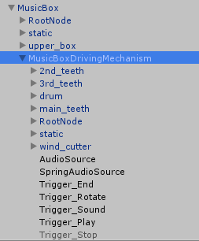

# VRChat向けジュエリーボックス付きオルゴール取扱説明書

[TOP](index.md)

## ディレクトリ構成

```
.-- Audio
 |  |- G_AIR.wav : サンプル曲 G線上のアリア
 |  `- JewelryBox.wav : サンプル曲 JewelryBox
 |- Texture
 |  |- MusicBox2k : 2Kテクスチャ類（非推奨）
 |  `- MusicBox4k : 4Kテクスチャ類（推奨）
 |- MusicBox.unitypackage : Unityパッケージ
 |- MusicBox_OLD.fbx : 旧番FBXファイル
 |- MusicBox.fbx : 宝石箱単体のFBXファイル
 |- MusicBoxDrivingMechanism.fbx : 駆動部分のFBXファイル
 |- ModernMusicBox.fbx : モダンデザインの外箱FBXファイル
 |- README.txt : このファイル 
 `- LICENSE.txt : ライセンスファイル
```

モダンデザインのfbxファイルはメッシュ単体となっており、このディレクトリ構成中にはテクスチャが含まれません（そもそも無いので）
Unityパッケージの中にあるFBXに対してマテリアルを設定しているため、そちらを使う前提となっています。

## Unityパッケージ構成

```
MusicBox
 |- Animation
 |  |- OLD : 旧番のアニメーション設定
 |  |- MusicBox : 宝石箱の蓋の開閉のアニメーション設定
 |  `- DrivingMechanism : 機構部分のアニメーション設定
 |- Audio : オーディオクリップ類
 |- Material
 |  |- ModernMusicBox : モダンデザイン版のマテリアル設定
 |  |- MusicBox2k : 2Kマテリアル設定（非推奨）
 |  `- MusicBox4k : 4Kマテリアル設定（推奨） 
 |- FBX : FBXファイル類
 |- Thirdparty : モダンデザイン版に適用しているお休みさんのガラスシェーダが含まれます
 |- OLD : 旧番のprefabが格納されています
 |- MusicBox.prefab : 宝石箱と機構を統合し、各種Trigger設定済みのprefab（G線上のアリア）
 |- MusicBox_Original.prefab : 宝石箱と機構を統合し、各種Trigger設定済みのprefab（オリジナル曲）
 |- MusicBoxDrivingMechanism.prefab : 機構のみで動作する、各種Trigger設定済みのprefab（G線上のアリア）
 |- MusciBoxDrivingMechanism_Original.prefab : 機構のみで動作する、各種Trigger設定済みのprefab（オリジナル曲）
 |- ModernMusicBox.prefab : ケースと機構を統合し、各種Trigger設定済みのprefab（G線上のアリア）
 `- ModernMusicBox_Original.prefab : ケースと機構を統合し、各種Trigger設定済みのprefab（オリジナル曲）
```


## 使い方

`MusicBox.unitypackage` をUnityのProjectへImportします。
Import前にVRC SDKを取り込んでいないと組み込んである `VRC_Trigger` 類のコンポーネントがロードされませんので、ご注意ください。


その中の `MusicBox.prefab` を `Hierarchy` にドロップすると、`MusicBox`というゲームオブジェクトが生成されます。
（`MusicBox_Original.prefab`, `ModernMusicBox.prefab`, `ModernMusicBox_Original.prefab` のいずれかでも大丈夫です）



これを好きなように配置するだけで使えるようになります。
曲を変更する場合は、[自分の好きな曲を設定する方法](customize_music.md) を参照してください。

また、`MusicBoxDrivingMechanism.prefab` という改変用に機構を分離したprefabも用意しました。
こちらの改変方法については新設の [オルゴールそのものの改変方法](customize_mbox.md) を参照してください。


## ジュエリーボックスの扱いについて

赤い部分はジュエリーボックスになっていますので、Unity上でアクセサリのオブジェクトをいい感じに配置してそれっぽく見えるようにするといいかんじです。

---

Copylight(c) 2019 Azurite
