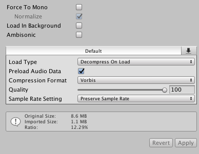

# ジュエリーボックス付きオルゴール取扱説明書

## オーディオを最適化して容量を減らす方法

オーディオファイルはとてつもなく重いです。
VRChatのワールドは数MBから数百MBまで幅広い容量のものがありますが、
そのうちBGM1曲だけで数MB占有されることは避けたいです（オルゴールは小物なので小物に数MB取られてしまうのはちょっと心苦しいです）。
そのため、音質を調整して妥協点を見出しつつ容量を削減していくことが必要です。

Unityのプロジェクトに `.wav` や `.mp3` 形式のオーディオファイルを追加し、
生成されたオーディオクリップ選択するとInspector上に以下のような設定が表示されます。
下部に `Original Size:` という項目と、`Imported Size:` という項目がありますが、
この `Imported Size:` が最終的にUnityで扱われる最適化されたサイズになるため、
このサイズを各項目を設定していくことで減らしていくことが目標となります。

* `Force to Mono`: 音声データを強制的にモノラル変換します。VRの場合、マルチチャンネルを絶ってしまうとかなり残念になるのでオススメしません
* `Normalize`: 語弊を恐れずに言うと、音量を一定にします。`Force to Mono`を有効化すると選択できます
* `Load in Background`: バックグラウンドでデータをロードします。容量には関わらないですが、オンにしておくと別スレッドで読み込んでくれるのでちょっと快適になるかもしれません
* `Ambisonic`: 全周のサラウンド音声を表現するための手法です。オルゴールには関係ないので割愛します
* `Load Type`: オーディオをどのように扱うかの設定です（ロード時に展開するのか、圧縮したままメモリに乗せるのか、ストリーミングするのか）
* `Preload Audio Data`: オンにしておくとシーンロード時にオーディオクリップが読み込まれます
* `Compression Format`: 圧縮形式です。デフォルトはゲーム向きの `Vorbis` となっています
* `Quality`: 圧縮率です。高くするほどサイズが顕著に下がっていきますが、その分音質も下がっていきます
* `Sample Rate Setting`: サンプリング周波数の設定です。デフォルトか、自動最適化か、直接リサンプリングする周波数を指定することができます

ざっと並べてみましたが、より詳しい情報は公式リファレンス [オーディオクリップ](https://docs.unity3d.com/jp/current/Manual/class-AudioClip.html) を参照してください。
