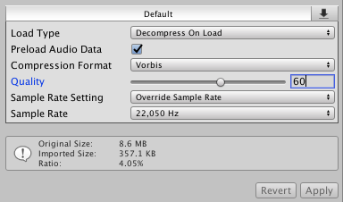
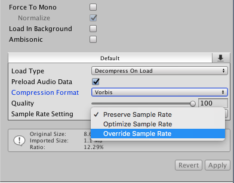
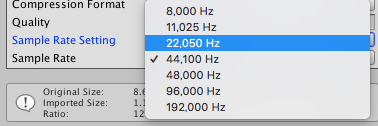
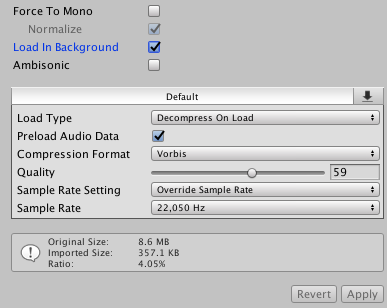

# ジュエリーボックス付きオルゴール取扱説明書

## オーディオを最適化して容量を減らす方法

オーディオファイルはとてつもなく重いです。
VRChatのワールドは数MBから数百MBまで幅広い容量のものがありますが、
そのうちBGM1曲だけで数MB占有されることは避けたいです（オルゴールは小物なので小物に数MB取られてしまうのはちょっと心苦しいです）。
そのため、音質を調整して妥協点を見出しつつ容量を削減していくことが必要です。

### オーディオクリップの設定

Unityのプロジェクトに `.wav` や `.mp3` 形式のオーディオファイルを追加し、
生成されたオーディオクリップ選択するとInspector上に以下のような設定が表示されます。
下部に `Original Size:` という項目と、`Imported Size:` という項目がありますが、
この `Imported Size:` が最終的にUnityで扱われる最適化されたサイズになるため、
このサイズを各項目を設定していくことで減らしていくことが目標となります。

* `Force to Mono`: 音声データを強制的にモノラル変換します。VRの場合、マルチチャンネルを絶ってしまうとかなり残念になるのでオススメしません
* `Normalize`: 語弊を恐れずに言うと、音量を一定にします。`Force to Mono`を有効化すると選択できます
* `Load in Background`: バックグラウンドでデータをロードします。容量には関わらないですが、オンにしておくと別スレッドで読み込んでくれるのでちょっと快適になるかもしれません
* `Ambisonic`: 全周のサラウンド音声を表現するための手法です。オルゴールには関係ないので割愛します
* `Load Type`: オーディオをどのように扱うかの設定です（ロード時に展開するのか、圧縮したままメモリに乗せるのか、ストリーミングするのか）
* `Preload Audio Data`: オンにしておくとシーンロード時にオーディオクリップが読み込まれます
* `Compression Format`: 圧縮形式です。デフォルトはゲーム向きの `Vorbis` となっています
* `Quality`: 圧縮率です。高くするほどサイズが顕著に下がっていきますが、その分音質も下がっていきます
* `Sample Rate Setting`: サンプリング周波数の設定です。デフォルトか、自動最適化か、直接リサンプリングする周波数を指定することができます

ざっと並べてみましたが、より詳しい情報は公式リファレンス [オーディオクリップ](https://docs.unity3d.com/jp/current/Manual/class-AudioClip.html) を参照してください。

### 圧縮率を高め、品質を下げる代わりに容量を削減する

`Compression Format` の下にある `Quality` は圧縮率を表します。圧縮するほど品質が下がっていくので、音質とサイズのバランスで妥協点を見つけるといいでしょう。
下にある `Apply` ボタンを押すと変更が反映され、下部のプレビューエリアから再生して確認することが出来ます。
（サンプルにつけているオーディオクリップは `60` あたりまで下げています）

### サンプリング周波数を変更し、容量を削減する

`Sample Rate Setting` のトグルボタンを押すと上記にある3つの選択項目が出てきます。
ここでサンプリング周波数をどのように変更するかを指定できます。サンプリング周波数とは、1秒間にどれぐらいの解像度で音を表すかを決めるものです。
例えば `44,100Hz` であれば、1秒間に44,100点もの解像度をもちます。3Dモデルでいう頂点に相当するものです。

ここでは明示的にサンプリング周波数を下げることによって容量を削減します。もちろんこの作業を行うと解像度が下がりますので、音質も下がります。
こちらも変更してみて、妥協できる値を見つけてください。

まず、トグルメニューから `Override Sample Rate`を選択します。

すると新しく `Sample Rate Setting` という項目が下にできますので、そこから現在のサンプリング周波数から鑑みて丁度よさそうなものを選択しましょう。
（サンプルにつけているオーディオクリップは `44,100Hz` を `22,050Hz` まで下げています）

### 結果を確認する

上のスクリーンショットはモノラルデータですが、ここまで圧縮が出来ています。
